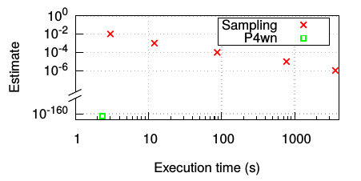
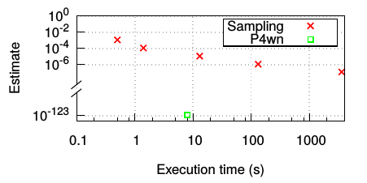
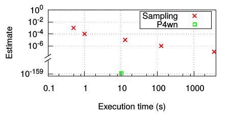

# P4wn: A Probabilistic Profiler for Stateful P4 programs


## Introdution

P4wn is a program profiling tool for understanding the program behaviors of
[P4](https://p4.org/) programs.
Different from existing tools such as Vera, P4wn is not designed to verify
correctness properties, such as finding out-of-bound memory accesses.
Instead, P4wn focuses on profiling probabilities. Concretely, it tells us
the probability for each [basic code blocks](https://en.wikipedia.org/wiki/Basic_block).

Please find more information about P4wn in our [ASPLOS'2021](https://asplos-conference.org/abstracts/asplos21-paper1594-extended_abstract.pdf)
paper.


## Setup

### Installing KLEE dependencies

P4wn is built upon KLEE, so we need to install KLEE dependencies first.
Follow the instructions [here](http://klee.github.io/releases/docs/v2.0/build-llvm60/).
Note that we only need to do the first 3 steps.

### Install LattE

LattE provides model counting support for P4wn.
Install LattE from [here](https://github.com/latte-int/latte-distro).
P4wn relies on the executable `count` in the LattE package to provide model
counting support.

Add the `count` program in your `PATH` environment. To do this, we can add the following
line to the `bashrc` file.

```
export PATH=$PATH:<path_to_folder_of_count>
```

### Install json lib

```
sudo apt-get install libjsoncpp-dev
```

### Configuration

P4wn uses [config.json](./config.json) to configure the path and default probability. Modify it accordingly.

You also need to update the path [here](./lib/Core/ModelCounter.cpp#L26), so that P4wn can locate the configuration json file.

Notice that P4wn uses line number to query the probability of expressions that cannot be identified automitically. If you change the program, please remember to update the line number in the configuration json.


### Build P4wn

After installing the dependencies, we can download and build P4wn from source.


```
git clone git@github.com:qiaokang92/P4wn.git
cd P4wn
mkdir build
cd build
cmake -DENABLE_SOLVER_STP=ON -DLLVM_CONFIG_BINARY=/usr/bin/llvm-config-6.0 -DENABLE_UNIT_TESTS=OFF -DENABLE_SYSTEM_TESTS=OFF ..
make -j<N>
```

This will essentially builds a `klee` executable, which is the modified KLEE.
Let's add the following line in the `.bashrc` file:
```
alias p4wn="<p4wn_folder>/build/bin/klee"
```

## Using P4wn to profile network programs

First compile the program:
```
# compile
clang-6.0 -I <path_to_klee_include_folder> -emit-llvm -c -g -O0 -Xclang -disable-O0-optnone <program.c>
# or
clang-6.0 -I /home/qiaokang/dpattacks/tools/klee-prob/include -emit-llvm -c -g -O0 -Xclang -disable-O0-optnone <program.c>
```

It will generate a `.bc` file. Then use p4wn to run this file:
```
p4wn --real-trace <trace-on> --num-trace-pkt <pkt-num> --program-num <num> --num-loop <loop> --converge-delta <delta> <program.bc>
```

Then the per-branch probabilities will be printed in sorted order.

Explanation of parameters:
- `trace-on`: if true, then P4wn will query the trace for header distribution;
otherwise it invokes the model counter.
- `pkt-num`: if `trace-on` is set, then it specifies the number of pkts
when checking the trace.
- `num`: program number.
- `loop`: number of symbolic packets to explore
- `delta`: specifies whether the per-path probabilities have converged:
In N+1'th round, if the diff of all probs (compared with Nth round)is less
than delta, then we say the profile has converged.

Please follow the READMEs in the subfolders for understand the concrete
examples of how P4wn works.

- `examples`: includes example P4 programs that we have tested.
- `telescope`: shows how we can scably profile "deep" code blocks.

## P4-to-C Translator

The translator is built upon the P4-to-C translator in
the [ASSERT-P4](https://github.com/gnmartins/assert-p4) project.
Refer to this [README](https://github.com/gnmartins/assert-p4) to setup
p4c and bmv2 environment.


First, Compile p4 code to json.

```
p4c/build/p4c-bm2-ss <input-filename>.p4 --toJSON <output-filename>.json
```

Translate json to C.

```
python ../src/myP4_to_C.py <filename>.json <input file>.json <nums_of_pkts>
```

`<filename>.c` will be automatically generated.


## Tested programs

This folder includes all tested programs that we tested. The `translator`
folder includes the P4-to-C translator that we use. For some programs that
the translator does not support (e.g., Poise, which is written in Tofino P4),
we have manually translated the P4 program.


### switch.p4

In this experiment, we want to test how P4wn/KLEE scales with the most complicated
P4 program -- switch.p4. First, we used the translator to generate
`switch_16.c`, which is original switch.p4 program (C version). Our experience of
running this program is reported in Appendix A.2 of our paper.

Next, we leverage Vera's "concrete packet layout" optimization to modify the
switch.p4 program -- we instrumented the parser code to make sure that this
program only accepts only concrete packet layout (i.e., a typical IPv4/TCP packet).
The modify program is `switch_16_one_pkt_layout.c`. We found that running
this program will be very fast, and the result is also reported in our paper.

### Poise


poise.p4 P4 program is from https://github.com/qiaokang92/poise.
We have manually translated this P4 program to poise.c

To run this program using P4wn:
```
p4wn --num-trace-pkt 10000 --real-trace 1 --program-num 0 --num-loop 3 --batch-instructions=1000 --converge-delta 1e-10 poise.bc
```

### NetWarden

netwarden.c is from https://github.com/jiarong0907/NetWarden
and generated based on its [timing channel detection system]
(https://github.com/jiarong0907/NetWarden/tree/master/release/timing).
The core logic is in `timing.p4`.

```
p4wn --num-trace-pkt 10000 --real-trace 1 --program-num 1 --num-loop 3 --batch-instructions=1000 --converge-delta 1e-10 netwarden.bc
```

### Blink

Blink has two implementations: P4 and Python, which are essentially same.
Our implementation blink.p4 implements its core logic of
its [python version](https://github.com/nsg-ethz/Blink/tree/master/python_code)

```
p4wn --num-trace-pkt 10000 --real-trace 1 --program-num 2 --num-loop 5 --batch-instructions=1000 --converge-delta 0.001 blink.bc
```

The command above uses 5 symbolic packets and it is not able to profile
all blocks, refer to the Telescoping section for more details.


### Starflow

starflow.c is based on [starflow.p4](https://github.com/jsonch/StarFlow/blob/master/cache/p4Generic/p4src/starFlow.p4).

```
p4wn --num-trace-pkt 10000 --real-trace 1 --program-num 3 --num-loop 3 --batch-instructions=1000 --converge-delta 5e-6 starflow.bc
```

### NetCache

NetCache is based on [netcache.p4](https://github.com/netx-repo/netcache-p4/blob/master/p4src/netcache.p4).

```
p4wn --num-trace-pkt 10000 --real-trace 1 --program-num 4 --num-loop 2 --batch-instructions=1000 --converge-delta 0.001 netcache.bc
```


### P40f

p40f.c is based on [p40f.p4](https://github.com/sherrybai/P40f/blob/master/src/p40f.p4).

```
probklee --num-trace-pkt 10000 --real-trace 1 --program-num 6 --num-loop 3 --batch-instructions=1000 --converge-delta 3e-16 p40f.bc
```


### LB

lb.c is based on [load_balanc.p4](https://github.com/p4lang/tutorials/blob/master/exercises/load_balance/solution/load_balance.p4)

Note: we model the hash value of 5-tuples as symbolic value, by borrowing
the idea of havocing. At the backend of KLEE, we issues queries to trace/model
counter to get the distribution of this value.

```
probklee --real-trace 1 --num-trace-pkt 1000 --program-num 7 --num-loop 1 --batch-instructions=1000 lb.bc
```


### Flowlet

flowlet.c is based on [flowlet_switching.p4](https://github.com/p4lang/p4c/blob/master/testdata/p4_14_samples/flowlet_switching.p4)


```
probklee --real-trace 1 --num-trace-pkt 1000 --program-num 8 --num-loop 3 --batch-instructions=1000 --converge-delta 8e-06 flowlet.bc
```


### NAT and ACL

P4 code: [acl.p4](https://github.com/p4lang/p4c/blob/master/testdata/p4_14_samples/acl1.p4)
and [nat.p4](https://github.com/p4lang/p4c/blob/master/testdata/p4_14_samples/simple_nat.p4).
These two programs are stateless, as they use a single match/action table for
processing packets. Our C programs also uses single table.

```

p4wn --real-trace 1 --num-trace-pkt 1000 --program-num 9 --num-loop 1 --batch-instructions=1000 nat.bc
p4wn --real-trace 1 --num-trace-pkt 1000 --program-num 10 --num-loop 1 --batch-instructions=1000 acl.bc
```

### NetHCF

nethcf.c is based on [nethcf.p4](https://github.com/NetHCF/NetHCF/blob/master/bmv2/switch/p4src/nethcf.p4), in our C program, we focus on its core logic:
handling normal/abnormal connections.

```
p4wn --real-trace 1 --num-trace-pkt 1000 --program-num 11 --num-loop 1 --batch-instructions=1000 nethcf.bc
```

## Telescoping

After running P4wn we will find that it fails to profile certain code blocks
because they need very long pkt sequences to trigger.
We use "telescoping" to trigger them.

The example below shows how we use telescope to profile Blink's probabiliy
of triggering rerouting using 32 packets.

```
cd telescoping/blink
p4wn --program-num 2 --real-trace 1 --enable-ts 1 blink.bc
```
Result is 2.28091e-160.

**Note:** The figure 8 in the paper shows the telescoping result of P4wn when using static probability (e.g., prob=0.5). The probability of P4wn when using real trace is shown as below. From left to right, they are blink(S5), netcache(S6), and netwrden(S11). As we can see, P4wn can use telescoping to achieve much more fine-grained estimates.

<div align="center">



</div>


## License

P4wn retains KLEE's [University of Illinois/NCSA
Open Source License](https://github.com/klee/klee/blob/master/LICENSE.TXT).
